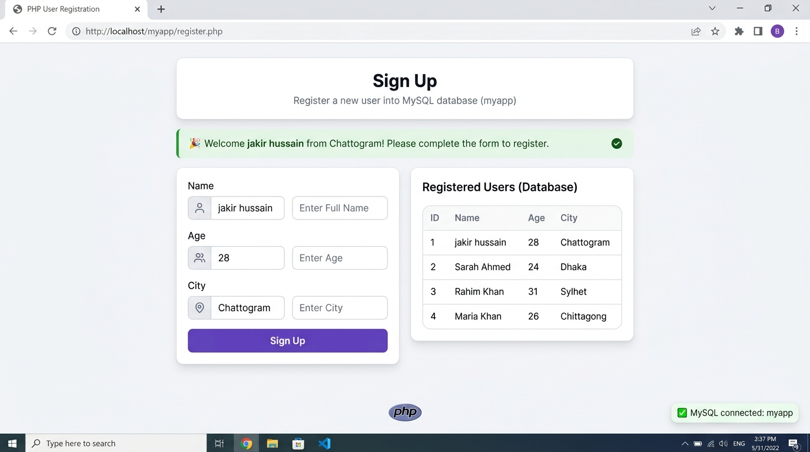
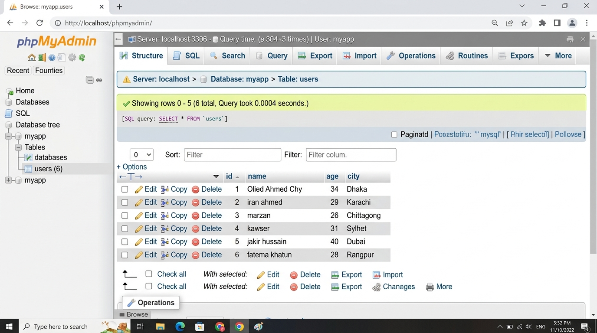

# PHP Basics + MySQL Assignment: User Sign Up & Management System

A dynamic, full-stack user registration and management application built with **PHP (PDO)** and **MySQL**. This project demonstrates core backend fundamentals including database connectivity, CRUD operations, input sanitization, error validation, and responsive UI design.

---

## 📸 Screenshots & Previews

### 1. Frontend Sign Up Form & Registered Users Table


### 2. MySQL Database (`myapp` / `users` Table in phpMyAdmin)


---

## 🚀 Features

- **Automatic Database & Table Setup**: Automatically creates the `myapp` database and `users` table via PDO if they don't already exist.
- **Server-Side Validation**:
  - Name is required (non-empty).
  - City is required (non-empty).
  - Age validation (optional, must be a valid positive integer between 1 and 120 if entered).
- **Secure Database Operations**: Uses **PDO Prepared Statements** to prevent SQL injection vulnerabilities.
- **XSS Protection**: Sanitizes output with `htmlspecialchars()` to prevent Cross-Site Scripting.
- **Live User Listing**: Fetches and displays all registered users in descending order with total count badge.
- **Interactive Feedback**:
  - Success banner with user personalized details (`Welcome [Name] from [City]!`).
  - Clear error summary for any invalid inputs.
  - Sticky form fields so entered data is preserved on validation error.

---

## 🛠️ Tech Stack

- **Backend**: PHP 7.4+ / 8.x (PDO)
- **Database**: MySQL / MariaDB (`myapp` database)
- **Frontend**: HTML5, Vanilla CSS (Modern Card UI & Glassmorphism design)
- **Environment**: XAMPP / Apache Web Server

---

## 🗄️ Database Schema

```sql
CREATE DATABASE IF NOT EXISTS `myapp` CHARACTER SET utf8mb4 COLLATE utf8mb4_unicode_ci;
USE `myapp`;

CREATE TABLE IF NOT EXISTS `users` (
    `id` INT AUTO_INCREMENT PRIMARY KEY,
    `name` VARCHAR(255) NOT NULL,
    `age` INT NULL,
    `city` VARCHAR(255) NOT NULL
) ENGINE=InnoDB DEFAULT CHARSET=utf8mb4 COLLATE=utf8mb4_unicode_ci;
```

---

## ⚙️ Installation & Setup (Localhost)

1. **Clone or Download the Repository:**
   ```bash
   git clone https://github.com/Olied-Ahmed-chowdhury/PHP-Basics-MySQL-Assignment.git
   ```

2. **Move to XAMPP `htdocs` folder:**
   Copy the project folder into your XAMPP web root:
   ```text
   C:\xampp\htdocs\PHP-Basics-MySQL-Assignment
   ```

3. **Start XAMPP Services:**
   - Open **XAMPP Control Panel**.
   - Start **Apache** and **MySQL**.

4. **Run the Project:**
   Open your browser and navigate to:
   ```text
   http://localhost/PHP-Basics-MySQL-Assignment/signup.php
   ```
   *(Note: The database `myapp` and table `users` will be created automatically on first load!)*

---

## 👤 Author

- **Name**: Olied Ahmed Chowdhury
- **GitHub**: [@Olied-Ahmed-chowdhury](https://github.com/Olied-Ahmed-chowdhury)
